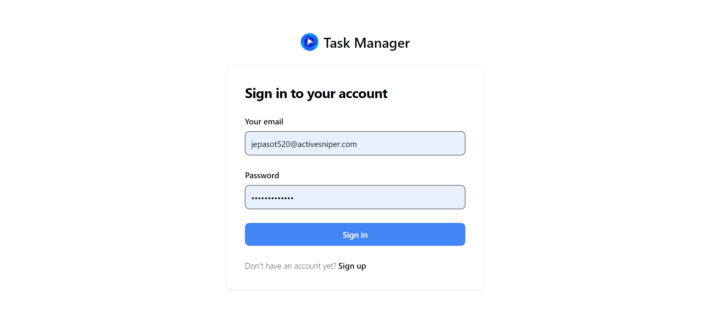
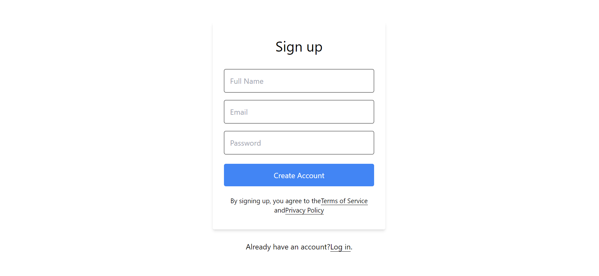
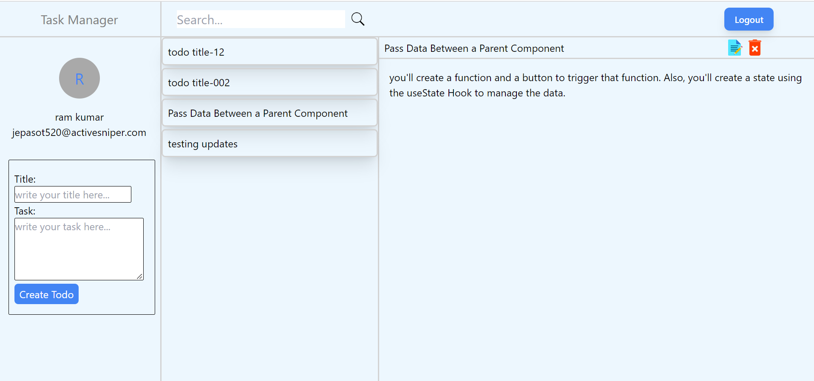

# Full Stack Task Manager WebApp | MERN 

Hi, I am **Vipransh Verma**, an aspiring **full stack JavaScript developer**.

# Project Images
### Login Page

### SignUp Page

### Dashboard
s

# Features
### . User Authentication 
### . Create Todo
### . Update Todo
### . Read Todo
### . Delete Todo
### . Search Todo
### . user can logout

## Appwrite is used for user authentication
[Appwrite Docs](https://appwrite.io/docs)

### `npm start`

Runs the app in the development mode.\
Open [http://localhost:3000](http://localhost:3000) to view it in your browser.